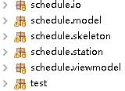
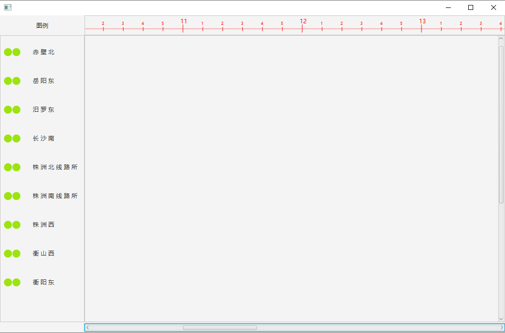

**本软件开发相关资料：** 高速铁路调度指挥仿真实验教程  

**开发人员：** 谭老师，喻斗  

**开发语言：** java  

**软件：** eclipse（需要安装javafx插件，方便mvc模式各层分离）

**jdk版本：** 1.8    

**消息队列组件：** rabbit mq  

**前端组件：** javafx  

**测试系统：** 中标麒麟

***

**代码结构为：**

IO包用于读写操作，包括来自本地和网络的读写。

model包为IO包读入信息后，构建的模型，与UI没有直接关系。

viewmodel包用于绑定到UI显示和操作的信息。

skeleton包为UI界面骨架，用于装载各个部件。

station包为运行图部件，运行图是以站为单位垂直堆叠，站包括展开状态和折叠状态，目前在设计中。

**软件数据流大致为：**

IO读取数据，model解析数据形成时刻表，viewmodel提取UI所需信息，skeleton和station包负责前台操作

运行图如下：

**后续阶段的计划：**

1. 完成station包中站场的设计，包括折叠和展开，通过测试

2. 下周若有剩余时间，测试拖拽代码，（目前多条线的移动还没有测试）

3. 后续开发尽量保持模块的低耦合，让数据驱动软件，尽量减少模块间的调用

4. UI主线程的异步测试，使用多线程，确保界面响应的及时
    - 网络延时测试
    - 大量绘制线条可能会出现卡顿
    - 网络I/O过大时卡顿
    - 本地I/O过大时卡顿
    
***

**工作描述：**  

谭：*******  

喻：列车运行调度模块设计（参考实验教程实验一和实验二）  
1. 菜单  
    - 系统登录  
    - 参数设置  
    - 绘制运行符号（重）  
        列车运行线：
        区间封锁  
        区间慢行  
        车站封锁  
        车站慢行  
        电网检修  
        图表记载  
        区间作业取消绘制
    - 阶段计划（重）  
        批量（分界口接入）计划  
        图定计划  
        删除运行线  
        恢复删除  
        批量删除计划线  
        恢复批量删除  
        删除全部计划停运线  
        下达计划  
        定时下达计划设置  
        申请邻台计划  
        批量选择计划线  
        批量移动计划线  
        按间隔分隔批量线条  
        更改通过/到开  
    - 列车管理  
    - 显示选项
    - 培训方案管理  
    - 帮助  
2. 主画布
    - 行 面板  
        当前工作运行图，用于铺画列车运行计划并进行阶段计划的调整  
    - 日 面板  
        查询日班计划在本台的落成情况  
    - 施 面板  
        查看本台施工计划信息，包括相应的施工计划以及施工调度台提前拟写的调度命令  
3. 工具栏
    - 状态栏  
        显示时间，选中车次信息等  
    - 车次搜索  
    - 触  
        改变车站进路触发方式  
    - 转实际  
        将列车运行线从开始站到选中的车站的运行点转换为实际点  
    - 下计划  
        下达阶段计划到所管辖的车站  
    - 发送本台阶段计划到邻台  
    - 接收邻台计划  
        邻台计划发送到本台后，本台会有机器提示声，点击本按钮可接收计划  
    - 开始手工画线  
    - 结束手工画线  
    - 放大运行图  
    - 缩小运行图  
    - 显示上行运行线  
    - 显示下行运行线  
    - 鼠标收点  
        手工将列车的计划线上的点转为实际  
    - 显示正晚点信息  
        显示已转实际的列车的正晚点信息  
    - 显示本台基本运行图  
    - 显示乘务机车叫班信息  
    - 显示区间运行时间分析  
    - 显示车底接续情况  
    - 显示运行线上机车信息  
    - 显示运行线的交出车次  
4. 鼠标右键菜单  
    - 按点选中  
    - 按线选中  
5. 交班存图
